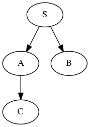

# causal-optoconnectics
Causal inference of connectivity between neurons

# Introduction
When estimating connectivity between neurons, confounders are your enemy when
you desire an estimate that reflects the causal (mechanistic) influence
between neurons.
Confounding arises when there is a common drive that
influences multiple neurons simultaneuously. For example, consider three neurons
A, B, C, and S - the confounder (could be a neuron or stimulation or both),
connected by the following graph:



Here we refer to A and B as (putative) upstream (presynaptic) neurons and C as
a (postsynaptic) downstream neuron.

Say we are interested in estimating the influence of A -> C and B -> C.
When simply correlating them we end up with a spurious correlation between
B and C (cor(B, C) > 0) due to the confounding effect of S (giving cor(A, B) > 0).

Here we use the instrumental variable technique as a two stage regression
to quench any spurious correlation.
Thus obtaining the causal influence between neurons i.e. A -> C > 0 and B -> C = 0.

Specifically, say we are stimulating A and B with optogenetic stimulus but not C.
Furthermore, say the stimulus duration is on the same order of magnitude as the
refractory time.
If the stimulation onset time is random, we are bound to stimulate during the
refractory time.
Assuming that the membrane potential of A and B are random at small
time scales, then the times we hit the refractory period of one or the other
is independent of one another.
Finally, the refractory period cannot affect the downstream neuron i.e. there is
no influence of the instrument on the downstream neuron.
This gives us the possibility to use the refractory period of the neurons as instruments.

The estimation proceeds as follows:
1) for each stimulation onset time we extract the relative time of preceding
and succeeding spikes from the upstream neuron.
2) the succeeding spike is cast into a binary variable indicating if the spike
fell within a given window of time.
3) the preceding spike is represented with a raised cosine basis which have
logarithmically stretched time giving higher fidelity closer to stimulus onset time.
4) a logistic regression is obtained with raised cosine representation of
preceding spikes as exogenous and the binary representation of succeeding spikes
as endogenous. This is the first stage of the two stage regression.
5) number of downstream response spike times relative to stimulus onset time is
counted within a given window.
6) the fitted values from the first stage is then regressed on the downstream
count, and the slope gives the estimated causal effect.

The interpretation of the results obtained with this procedure is the difference
between the rate of the downstream neuron with (measured C_rate) and without
(counter-factual C_rate') the connectivity from the upstream neuron divided
by the sum of the upstream rate and the rate of stimulation.
In other words (C_rate - C_rate') / (A_rate + S_rate).

# Examples of usage
See also examples found in the examples directory.
```python
iv_params = {
    'x_mu': 2e-3,
    'x_sigma': 1e-3,
    'y_mu': 6e-3,
    'y_sigma': 2e-3,
    'n_bases': 20,
    'bin_size': 1e-3,
    'offset': 1e-2
}

beta_AC = causal_connectivity(
    x=A_spikes, y=C_spikes, stim_times=stim_times, **iv_params)
```
